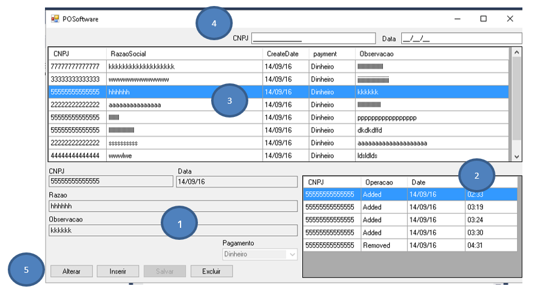
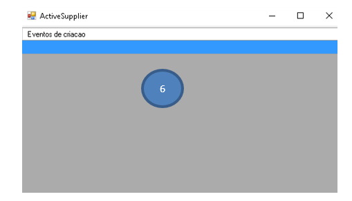

## Descrição Geral

Software de cadastro de pedido com notificação via UDP

## PCSoftware

1. Formulario fabricante
    Aqui será visualizado e inseridos informacoes sobre o fabricante.

2. Historico (log) de alteracoes  na base de fornecedores
    Lista automaticamnete o histórico das alteracoes do fornecedor listado no item 3

3. Lista de fornecedores
   Apresenta a lista dos fornecedores que poderá ser filtrada pelos campos do item 4

4. Filtros
   Entrada dos filtros

5. Botoes
   Comando para manutenção da base de fornecedores

## ActiveSupplier

6. Lista de notificaçõess
    A tela é atualizada a cada 2 segundos.

## Teste

## Comunicação

UDP socket

## Database first

Com a proposta de não ter cógido SQL junto ao fonte para facilitar manutenções futuras da base e do software 
a solução adotada foi o uso do entityframework onde a base de dados é toda abstraida inclusive as consultas 
que são armazeanadas na própria base.

Em POSoftware > Infra > Model1.edmx é possivel visualizar o MER da base. A manutenção do modelo está sendo 
mantida atraves da própria ferramenta do VS. 

## Code first

Para gerar o modelo

    enable-migrations
    update-database
    update-database -verbose -script

## Configuração 

Instalar os pacotes abaixo através do PMC:

    install-package entityframework
    install-package ninject
    install-package CommonServiceLocator
    install-package CommonServiceLocator.NinjectAdapter.Unofficial
